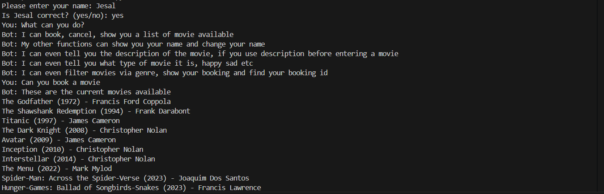
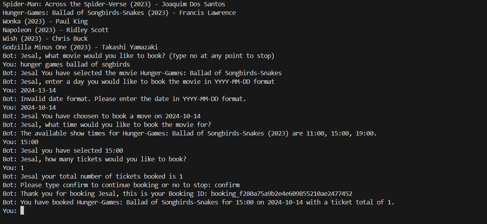
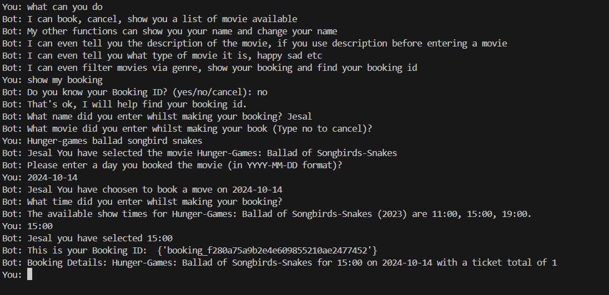

# NLP Movie Chatbot

This project is an AI-based chatbot designed to assist users with movie bookings. It uses natural language processing (NLP) techniques to understand user input and provide appropriate responses related to movie details and booking actions.

## Booking a Movie




## Find Booking


## Features

- **Movie Booking Functionality**: The chatbot can store, update, insert, and delete booking information using `bookings.db`.
- **Intent Prediction**: Utilises TF-IDF vectors to match user input with predefined intents and predict appropriate responses based on cosine similarity.
- **Preprocessing**: User input is cleaned, tokenised, and lemmatised before intent prediction.
- **Context-Aware Responses**: The chatbot retrieves movie details like title and director from `movie_database.db` and provides relevant information to the user.
- **Error Handling**: The chatbot includes basic error handling and ensures appropriate user interaction by filtering invalid inputs.
- **Ethical and Inclusive Design**: The system has been designed to respect user privacy and ensure there is no bias in its interaction.

## Data

The chatbot uses a dataset (`dataset.csv`) consisting of two columns:
- **Intent**: Stores possible user input phrases.
- **Response**: Contains the corresponding chatbot responses or actions.

## How it Works

1. **Preprocessing**: User input is cleaned and processed (tokenisation, POS tagging, and lemmatisation).
2. **Intent Matching**: The chatbot converts both movie-related texts and user intents into TF-IDF vectors and matches the user input with the closest intent based on cosine similarity.
3. **Response Generation**: If the similarity score is above 0.5, the chatbot returns the appropriate response or performs a booking function.

## Documentation

You can find the project's detailed documentation in the `docs` folder of this repository.

## Future Improvements

- **Accuracy Enhancement**: The chatbot's intent matching accuracy can be fine-tuned by adjusting the similarity thresholds.
- **Accessibility**: Future iterations could include screen reader support for users with vision difficulties.

## Ethical Considerations

The chatbot was designed to be respectful and inclusive, with no bias in its operations. It does not perform automated tasks and only stores necessary booking information. User privacy is a priority.

## Installation

1. Clone the repository:
    ```bash
    git clone https://github.com/jes4l/nlp-movie-chatbot.git
    ```

2. Install the required Python packages:
    ```bash
    pip install -r requirements.txt
    ```

3. Run the chatbot:
    ```bash
    python chatbot.py
    ```

## Contributing

Feel free to contribute by opening issues or submitting pull requests.

## License

This project is licensed under the MIT License.